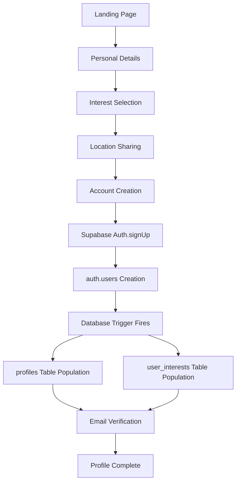

# How GoBuddy's User Signup Flow Works: From Frontend Collection to Database Population

GoBuddy's user registration system demonstrates a sophisticated approach to progressive data collection and database population using Supabase's authentication system combined with database triggers. Let's dive deep into how user data flows from the frontend through to the database tables.

## The Progressive Data Collection Journey

### 1. The Multi-Step Onboarding Flow

GoBuddy employs a progressive onboarding approach that breaks user registration into digestible steps:

```typescript
// The user journey: / → /details → /interests → /location → /signup → /confirmemail → /complete
```

Each step collects specific information using a centralized Zustand store ([`src/store/onboarding.ts`](src/store/onboarding.ts)):

```typescript
interface OnboardingState {
  email: string;
  password: string;
  name: string;
  age: number;
  interests: string[];
  address: IAddress;
  coordinates?: { lat: number; lng: number };
  newsletter: boolean;
}
```

### 2. Data Collection Stages

**Personal Details ([`app/routes/details.tsx`](app/routes/details.tsx))**

- Collects user's name and age
- Uses form validation with [@modular-forms/react](app/routes/details.tsx)
- Data stored in onboarding store for later use

**Interest Selection ([`app/routes/interests.tsx`](app/routes/interests.tsx))**

- Users select from predefined interests
- Simple toggle interface with visual feedback
- Interests stored as an array of strings

**Location Sharing ([`app/routes/location.tsx`](app/routes/location.tsx))**

- Two-part location collection: coordinates + address
- Uses geolocation API for precise positioning
- OpenStreetMap integration for address lookup
- Stores both coordinate data and structured address information

## The Signup Object: Preparing Data for Supabase

When users reach the signup page ([`app/routes/signup.tsx`](app/routes/signup.tsx)), all collected data is assembled into a structured signup object:

```typescript
const signupObject = useMemo<SignupRequestData>(() => {
  return {
    email,
    password,
    options: {
      data: {
        first_name: name,
        age,
        coordinates: coordinates ? `POINT(${coordinates.lat} ${coordinates.lng})` : null,
        postcode: address.postcode,
        city: address.city,
        country: address.country,
        country_code: address.country_code,
        longitude: coordinates?.lng,
        latitude: coordinates?.lat,
        interests,
        newsletter,
      },
      emailRedirectTo: `${window.location.protocol}//${window.location.host}/complete`,
    },
  };
}, [email, password, name, age, coordinates, address, interests, newsletter]);
```

### Key Data Transformations

1. **Coordinates**: Converted to PostGIS POINT format (`POINT(lat lng)`) for database storage
2. **Separate lat/lng**: Kept as individual numbers for convenience
3. **Structured Address**: Includes postcode, city, country, and country code
4. **Interests Array**: Maintained as string array for processing

## Supabase Authentication and Metadata Storage

The signup process uses Supabase's built-in authentication:

```typescript
const { data, error: signUpError } = await supabase.auth.signUp(signupObject);
```

When [`supabase.auth.signUp()`](app/routes/signup.tsx) is called:

1. **User Creation**: Supabase creates an entry in `auth.users`
2. **Metadata Storage**: The `options.data` object is stored in `raw_user_meta_data`
3. **Email Verification**: User receives confirmation email
4. **Trigger Execution**: Database trigger function automatically processes the data

## Database Population Through Triggers

The magic happens in the Supabase database trigger function. This PostgreSQL function executes automatically when a new user is inserted into `auth.users`:

```sql
DECLARE
    interests uuid[];
BEGIN
    -- Insert basic profile data
    INSERT INTO public.profiles (
        profile_id,
        first_name,
        age,
        postcode,
        city,
        country,
        country_code,
        coordinates
    )
    VALUES (
        NEW.id,
        NEW.raw_user_meta_data ->> 'first_name',
        (NEW.raw_user_meta_data ->> 'age')::int4,
        (NEW.raw_user_meta_data ->> 'postcode'),
        (NEW.raw_user_meta_data ->> 'city'),
        (NEW.raw_user_meta_data ->> 'country'),
        (NEW.raw_user_meta_data ->> 'country_code'),
        extensions.ST_GeomFromText(NEW.raw_user_meta_data ->> 'coordinates')
    );

    -- Process interests array and insert user_interests
    INSERT INTO public.user_interests (profile_id, interest_id, description)
    SELECT
        NEW.id AS profile_id,
        (value->>'interest_id')::uuid AS interest_id,
        (value->>'description')::text AS description
    FROM jsonb_array_elements(NEW.raw_user_meta_data -> 'interests') AS arr(value);

    RETURN NEW;
END;
```

## How the Trigger Processes Data

### 1. Profile Table Population

The trigger extracts data from `raw_user_meta_data` using PostgreSQL's JSON operators:

- **`->>` operator**: Extracts JSON values as text
- **Type casting**: `::int4` converts age to integer
- **PostGIS integration**: `ST_GeomFromText()` converts the POINT string to geometry
- **Direct mapping**: Links profile to auth user via `NEW.id`

### 2. Interests Processing

The interests handling is particularly sophisticated:

```sql
SELECT
    NEW.id AS profile_id,
    (value->>'interest_id')::uuid AS interest_id,
    (value->>'description')::text AS description
FROM jsonb_array_elements(NEW.raw_user_meta_data -> 'interests') AS arr(value);
```

This code:

- **Expands JSON array**: `jsonb_array_elements()` breaks the interests array into individual objects
- **Extracts UUIDs**: Converts interest_id strings to UUID type
- **Batch insertion**: Creates multiple `user_interests` records in one operation

## The Complete Data Flow Architecture



## Benefits of This Architecture

### 1. **Progressive Enhancement**

- Users aren't overwhelmed with a single large form
- Each step focuses on specific data collection
- Clear progress indication throughout the flow

### 2. **Automatic Data Processing**

- No additional API calls needed after signup
- Database triggers ensure data consistency
- Atomic operations prevent partial data states

### 3. **Type Safety and Validation**

- TypeScript interfaces ensure data structure consistency
- Database-level validation through triggers
- Client-side validation for immediate feedback

### 4. **Scalable Architecture**

- Easy to add new onboarding steps
- Database triggers can be extended for additional processing
- Centralized state management with Zustand

## Technical Considerations

### SSR Compatibility

The signup flow includes server-side rendering safety measures:

```typescript
emailRedirectTo: isBrowser && safeWindow?.location ? `${safeWindow.location.protocol}//${safeWindow.location.host}/complete` : "/complete";
```

### Error Handling

Comprehensive error management at multiple levels:

- Client-side form validation
- Supabase authentication errors
- Database trigger error handling
- User-friendly error messages in Danish

### Security

- Password requirements enforced
- Email verification required
- Database-level data validation
- Secure coordinate data handling

## Conclusion

GoBuddy's signup flow demonstrates how modern web applications can create seamless user experiences while maintaining robust data integrity. By combining progressive data collection, centralized state management, and database triggers, the system efficiently transforms user input into structured database records without sacrificing user experience or data quality.

The use of Supabase's `raw_user_meta_data` as an intermediate storage mechanism, combined with PostgreSQL triggers for data processing, creates a powerful pattern that other applications can adopt for complex user onboarding scenarios.
